# Modular RAG Pipeline — PRD & Build Plan (TypeScript)

> 🤝 Goal: A modular, extensible RAG system with clear boundaries (Hexagonal/DDD), implemented in TypeScript on Hono+Bun, Effect (EffectTS) for DI/concurrency/resilience, Postgres+pgvector, Cohere Rerank, optional Graph RAG and AX/axRAG.  
> ✅ This single file contains: architecture & data flows (Mermaid), integration points, config & security notes, vertical slices, TDD workflow, worktree-based delivery plan, and acceptance criteria.

---

## 0) TL;DR (for the busy reviewer)

- **Core**: Readers → Chunker → Embeddings → VectorStore → Hybrid Retrieval → (Cohere Rerank) → RuleGate → Generator (GPT-5 mini/nano).
- **Extensibility**: Replace any port via Effect Layers (embedder, retriever, reranker, generator, graph).
- **Security**: No secrets in code or docs; only typed env schema (validated at runtime).
- **Delivery**: Vertical slices with git worktree (parallel, conflict-light), strict TDD and acceptance criteria.

---

## 1) Architecture (Hexagonal / Effect Services)

### 1.1 Component View
```mermaid
flowchart LR
  subgraph App[Hono HTTP API]
    I1[/POST /ingest/]
    I2[/POST /query/]
    I3[/POST /graph/*/]
    I4[/GET  /health/]
  end

  subgraph Orchestrators
    O1[Basic Orchestrator]
    O2[(Optional) AX/axRAG Orchestrator]
  end

  subgraph Services (Ports)
    R[IRetriever<br/>Hybrid (pgvector+trgm)]
    G[IGenerator<br/>OpenAI via AI SDK]
    RR[IReranker<br/>Cohere Rerank]
    GR[IGraphRetriever<br/>1–2 hops]
    EM[IEmbedder<br/>AI SDK Embeddings]
    RG[IRuleGate]
  end

  subgraph Infra
    DB[(Postgres + pgvector + pg_trgm)]
    LOG[(Telemetry: logs/metrics/traces)]
    CFG[(Config Layer: env schema)]
  end

  I1 --> O1
  I2 --> O1
  I3 --> O1
  I4 --> O1

  O1 --> R
  O1 --> GR
  O1 --> RR
  O1 --> RG
  O1 --> G

  R  --> DB
  GR --> DB
  EM --> DB
  O1 --> LOG
  O1 --> CFG
  O2 --> R
  O2 --> GR
  O2 --> RR
  O2 --> G
```

### 1.2 Data Flow (Query Path)

```mermaid
sequenceDiagram
  participant Client
  participant Hono as Hono API
  participant Orchestrator
  participant Retriever as Hybrid Retriever
  participant Graph as Graph Retriever
  participant Rerank as Cohere Rerank
  participant Gate as RuleGate
  participant Gen as Generator (GPT-5 mini/nano)
  participant DB as Postgres+pgvector

  Client->>Hono: POST /query {question, model, effort, topK}
  Hono->>Orchestrator: Execute request (Effect scope)
  Orchestrator->>Retriever: embed(query) + vector+trgm search
  Retriever->>DB: pgvector <=> + trigram
  DB-->>Retriever: topK base candidates
  Orchestrator->>Graph: (optional) 1–2 hop nodes → chunks
  Graph->>DB: nodes/edges/node_chunks
  DB-->>Graph: candidate chunks
  Orchestrator->>Rerank: rerank(query, candidates)
  Rerank-->>Orchestrator: reranked list
  Orchestrator->>Gate: apply minSources/minScore
  Gate-->>Orchestrator: selected context
  Orchestrator->>Gen: build prompt + generate
  Gen-->>Orchestrator: answer + citations
  Orchestrator-->>Hono: {grounded, answer, sources}
  Hono-->>Client: 200 OK (JSON)
```


### 1.3 Persistence Model (ER)
```mermaid
erDiagram
  documents ||--o{ chunks : contains
  nodes ||--o{ node_chunks : references
  nodes ||--o{ edges : links
  edges }o--|| nodes : to

  documents {
    text id PK
    text source
    text doc_name
    jsonb metadata
    timestamptz ingested_at
  }
  chunks {
    text id PK
    text document_id FK
    text content
    vector embedding
    jsonb metadata
  }
  nodes {
    text id PK
    text label
    text type
    jsonb metadata
  }
  edges {
    text id PK
    text src FK
    text rel
    text dst FK
    jsonb metadata
  }
  node_chunks {
    text node_id FK
    text chunk_id FK
    numeric weight
  }
```

---

## 2) Integration Points (no secrets, no hardcoding)

- **AI Models**
  - **Embeddings**: AI SDK → `openai.textEmbeddingModel('text-embedding-3-small')`.
  - **Generation**: AI SDK → `openai('gpt-5-mini'|'gpt-5-nano')` with `reasoningEffort`.
  - **Reranking**: Cohere Rerank REST API (`rerank-v3.5`); feature-flagged.
- **Database**
  - Postgres + `pgvector` + `pg_trgm` (managed via migrations).
- **Effect (EffectTS)**
  - Layers for Config/DB/Telemetry/Ports with typed errors, retries, timeouts, semaphores.
- **HTTP**
  - Hono routes: `/ingest`, `/query`, `/graph/*`, `/health`.
- **Observability**
  - Structured logs (JSON), metrics (counters/histograms), traces per stage.
- **Security**
  - Runtime env schema validation; **never** commit values.  
  - Env keys loaded only at process start; passed via Effect Config Layer.

---

## 3) Config & Security (typesafe, zero secrets in code/docs)

**Config contract (TypeScript types):**
```ts
export type AppConfig = {
  databaseUrl: string;
  openaiKey?: string;
  cohereKey?: string;
  embedDim: number;               // e.g. 1536
  defaultModel: 'openai/gpt-5-mini' | 'openai/gpt-5-nano';
  rerankEnabled: boolean;
  graphEnabled: boolean;
  axEnabled: boolean;
  timeouts: { retrieveMs: number; generateMs: number; rerankMs: number; };
  limits: { topK: number; rerankQps: number; };
};
```

**Rules:**
- Read from `process.env` **only through** a Zod schema (Effect Config Layer).
- No `.env` values in code/README; provide `.env.sample` with **placeholder variable names** only.
- Fail fast on missing/invalid config with a typed error; never default to insecure behavior.

---

## 4) Domain Ports (TypeScript-first)

```ts
export interface IEmbedder { embedMany(texts: string[]): Promise<number[][]>; }

export type Ranked = {
  chunkId: string; documentId: string; source: string;
  snippet: string; score: number;
};

export interface IRetriever { retrieve(query: string, topK?: number): Promise<Ranked[]>; }
export interface IGraphRetriever { retrieveGraphContext(query: string, nodeLimit?: number, hopChunkLimit?: number): Promise<Ranked[]>; }
export interface IReranker { rerank(query: string, candidates: Ranked[]): Promise<Ranked[]>; }

export type ReasoningEffort = 'minimal'|'low'|'medium'|'high';
export type Answer = { text: string; sources: Array<{documentId: string; chunkId: string; source?: string; snippet?: string;}>; };
export interface IGenerator { answer(q: string, ctx: Ranked[], model: string, effort: ReasoningEffort): Promise<Answer>; }

export interface IRuleGate { validate(candidates: Ranked[], minSources: number, minScore: number): { ok: boolean; selected: Ranked[]; }; }
```

Boundaries:
- **Application** depends only on ports.
- **Infrastructure** implements ports (adapters) and is swappable.
- **Orchestrators** compose ports; no direct infra imports.

---

## 5) Non-Functional Requirements

- **Performance**: p95 end-to-end query latency target ≤ **800ms** on modest corpora; measure retrieve/rerank/generate spans.
- **Reliability**: transient failures retry with backoff+jitter; circuit breaker on external providers.
- **Scalability**: horizontal app scale; DB indexes (ivfflat, trigram). Consider ANN or dedicated vector DB > 1M chunks.
- **Observability**: metrics: `queries_total`, `retrieve_latency_ms`, `rerank_latency_ms`, `generate_latency_ms`, `end_to_end_latency_ms`.
- **Compliance**: citations mandatory; “don’t know” when rule-gate fails.

---

## 6) Vertical Slices (delivery plan a junior can follow)

> 🌈 Each slice is self-contained, shippable, and mapped to Issues/Epics you created.

### Slice A — Core RAG (no rerank/graph) 🟢
**Scope**: Embedder, Chunker, Hybrid Retriever, Generator, RuleGate; `/ingest`, `/query`, `/health`.  
**Definition of Done**:
- `/ingest` accepts text docs; embeddings stored.
- `/query` returns grounded answer + top-K citations.
- Unit + integration tests passing; metrics exported.

### Slice B — Cohere Rerank 🔵
**Scope**: IReranker adapter + feature flag; score fusion; QPS/timeout/retries.  
**DoD**:
- Rerank improves NDCG@10 on golden set.
- Graceful fallback when key missing; latency impact ≤ agreed budget.

### Slice C — Graph RAG 🔴
**Scope**: nodes/edges/node_chunks tables; 1–2 hops; merge with hybrid results.  
**DoD**:
- `/graph/*` endpoints to upsert and link.
- Improved grounding on entity/relation queries.

### Slice D — AX/axRAG (optional) 🔸
**Scope**: AX orchestrator mode; bounded multi-hop with quality target.  
**DoD**:
- Mode switch `basic|ax` per request.
- No unbounded loops; budget respected.

### Slice E — Delivery & Ops 🟡
**Scope**: Makefile targets, CI (lint/typecheck/test/eval/build), runbooks.  
**DoD**:
- CI green; evaluation thresholds met; basic runbook present.

---

## 7) `git worktree` Workflow (safe parallelism)

> ⚠️ Keep `main` clean; each slice is a separate worktree (branch) in its own directory.

```bash
# 1) Ensure main is up to date
git checkout main && git pull

# 2) Create a slice branch in its own directory
git worktree add slices/slice-a -b slice/slice-a
cd slices/slice-a

# 3) Implement Slice A incrementally (TDD)
# ... commit small steps
git add -A && git commit -m "test: red case for retriever autocut"
git commit -m "feat: hybrid retriever initial impl" # after green
git push -u origin slice/slice-a

# 4) Open PR targeting main (from slice/slice-a)

# 5) After merge, remove worktree locally
cd ../.. && git worktree remove slices/slice-a
git branch -d slice/slice-a  # if merged
```

Repeat for `slice/slice-b`, `slice/slice-c`, etc.

---

## 8) TDD Workflow (TypeScript, Bun)

1) **Red**  
   - Write failing unit tests for a single behavior (e.g., `RuleGate.validate` thresholds, hybrid auto-cut).
   - Minimal fixtures; avoid network (mock providers).

2) **Green**  
   - Implement the smallest amount of code to pass.
   - Keep logic within the correct boundary (ports vs adapters).

3) **Refactor**  
   - Remove duplication; keep interfaces clean.
   - Add types where inference is weak; enforce strict TS.

4) **Integration Tests**  
   - Boot ephemeral schema (migrations).  
   - `/ingest` → `/query` happy path; ensure citations & grounded flag.

5) **Golden-Set Evaluation**  
   - JSON lines with `{ question, expected_sources[] }`.  
   - Compute precision@k, grounding%.

6) **Observability Assertions**  
   - Ensure metrics are emitted; trace spans present.

**Testing tools**: Bun test runner (or Vitest if preferred).  
**Mocks**: Stub AI SDK & Cohere with in-memory adapters for unit/integration tests.  
**No secrets**: CI uses mocks; nightly optional job can use real providers with org-level secrets.

---

## 9) Junior-Friendly Step-By-Step (Slice A example)

1) **Create worktree**: `git worktree add slices/slice-a -b slice/slice-a`.
2) **Add domain ports**: create `domain/ports/*.ts` with the interfaces above.
3) **Config Layer**: implement Zod schema; ensure app fails fast on bad env.
4) **DB Migrations**: create tables (`documents`, `chunks`) + extensions (`vector`, `pg_trgm`).
5) **Embedder**: adapter using AI SDK (batching, retry policy).  
   - TDD: stub embedder to deterministic vectors.
6) **Chunker**: simple window with overlap; TDD for boundaries.
7) **Hybrid Retriever**: vector `<=>` + trigram, fusion(0.7/0.3), **auto-cut**.  
   - TDD: seed test data; ensure order & cut behavior.
8) **RuleGate**: `minSources`/`minScore`; TDD covering all branches.
9) **Generator**: OpenAI mini/nano via AI SDK; prompt uses only retrieved context.  
   - TDD: mock LLM; assert prompt contains snippets and returns citations.
10) **Routes**: `/ingest`, `/query`, `/health` (Zod validate; 4xx/5xx mapping).
11) **Metrics**: expose counters & histograms; smoke test presence.
12) **Run & PR**: `bun run dev`, push branch, open PR with AC below.

**Slice A Acceptance Criteria**
- Ingest 1 doc → Query returns correct fact with ≥2 citations and `grounded=true`.
- p95 end-to-end latency ≤ 800ms (small corpus).
- All tests green; coverage ≥ 80% for core modules.

---

## 10) Risks & Mitigations

- **Provider rate limits** → Effect Semaphores + backoff; breaker on repeated failures.
- **DB hotspots** → ivfflat lists tuned; trigram index; cap `topK`; consider ANN if >1M chunks.
- **Cost control** → default to nano + low effort; rerank feature-flag; nightly real-provider tests only.
- **Complexity creep** → enforce boundaries (ports only in app); adapters remain swappable.

---

## 11) Future Work (prepared but optional)

- **Local Reranker** via ONNX/Candle behind IReranker.
- **Multimodal Readers** (Anyparser/Docling/MinerU) mapped to node_chunks for tables/figures/equations.
- **AX/axRAG** as quality-healing loop with budget.

---

## 12) Glossary (quick ref)

- **Hybrid Retrieval**: vector similarity (pgvector `<=>`) fused with trigram keyword similarity.
- **Auto-cut**: stop including low-score tail when score gap exceeds threshold.
- **Grounding**: answer is based on retrieved sources that clear RuleGate.

---

## 13) Appendix (Mermaid quick view)

### Request Lifecycle

```

---
